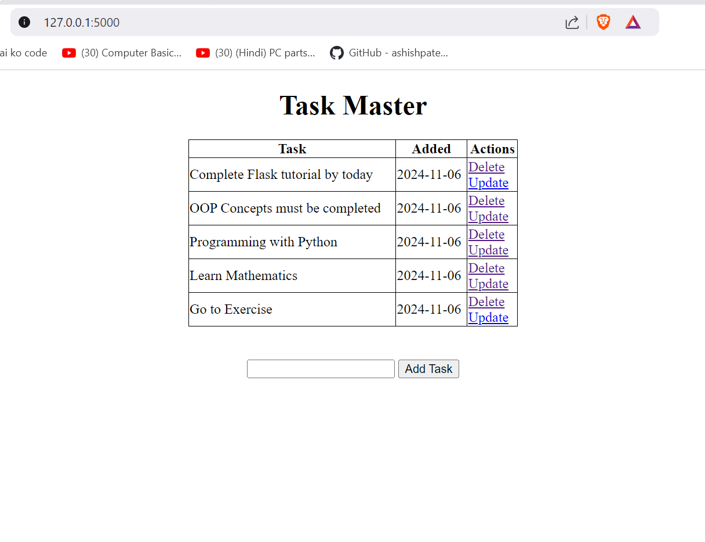

# To-Do-List in Flask. 


> `This is Flask Introduction Tutorial.  `

``` Python

from flask import Flask, render_template, url_for


app = Flask(__name__)

@app.route("/")
def index():
    return render_template('index.html')
    
if __name__ == "__main__":
    app.run(debug=True)

```

### Flask:


> Here is the demo of user interface in localhost.


